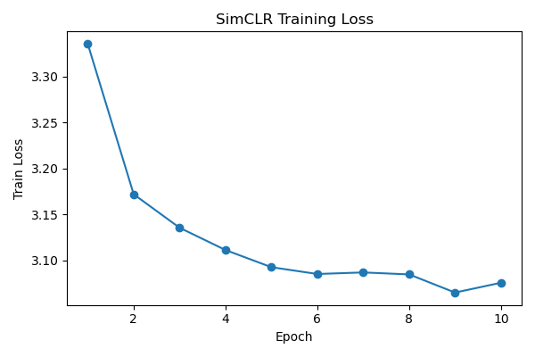
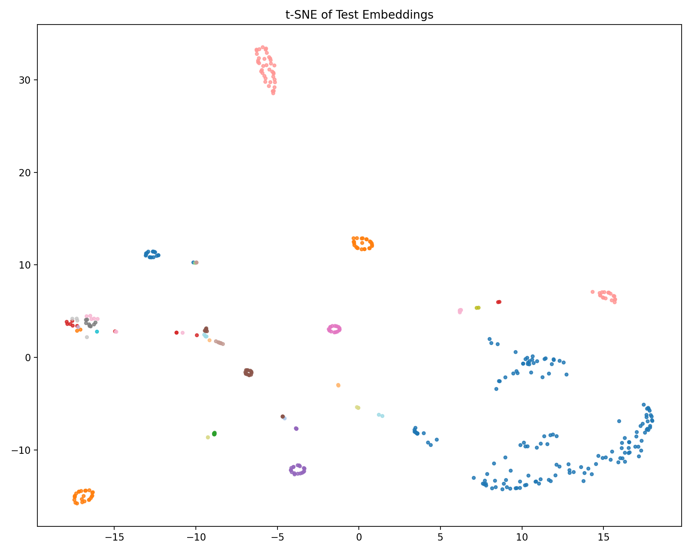
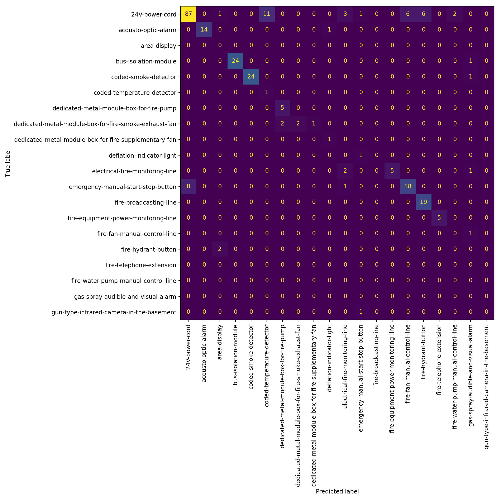
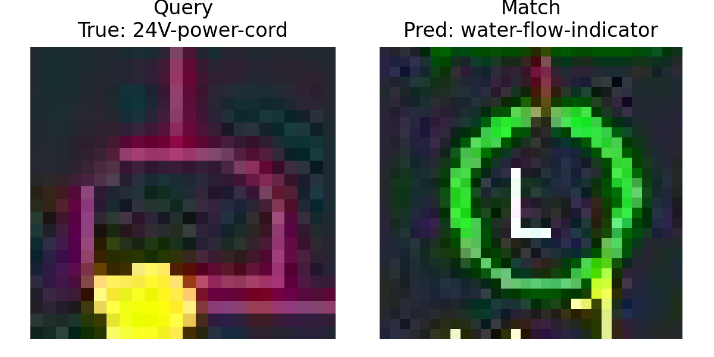

# Symbol Recognition in Technical Drawings using SimCLR

This project explores representation learning for recognizing symbols in technical drawings using contrastive learning.

The goal is to build a system that can generalize to **new symbol sets with minimal supervision**, enabling **0-shot or 1-shot symbol matching**, which is a key requirement for Bobyard's workflow.

---

# Problem

Bobyard needs to automatically recognize symbols in engineering drawings and identify their locations.

A key challenge is that each drawing set may contain **different symbol types**, so the system should generalize to **unseen symbols with only a few examples**.

Instead of training a fixed closed-set classifier, this project treats the problem as a **representation learning task**, where the model learns an embedding space for symbol similarity.

---

# Dataset

Dataset used:

Roboflow – *Firefighting Device Detection*

- Images: 148
- Classes: ~40
- Format: YOLOv8

YOLO bounding box annotations were used to extract **symbol-level crops**.

Dataset after preprocessing:

| Split | Images |
|------|------|
Train | 2606 symbol crops |
Validation | 755 symbol crops |
Test | 424 symbol crops |

---

# Pipeline

The pipeline used in this project:
Engineering drawings
→
YOLO bounding boxes
→
Symbol crops
→
SimCLR contrastive learning
→
Symbol embedding space
→
1-shot symbol matching


---

# Method

Model architecture:

- Encoder: **ResNet18 (ImageNet pretrained)**
- Representation learning: **SimCLR**
- Projection head: MLP
- Similarity metric: **cosine similarity**

Training objective:

Contrastive learning encourages the model to bring **augmented views of the same symbol closer in embedding space**, while pushing different symbols apart.

---

# Experiments

Two experiments were performed.

| Experiment | Temperature | Batch Size |
|-----------|------------|------------|
Baseline | 0.5 | 64 |
Experiment | 0.1 | 64 |

The temperature parameter controls the sharpness of the similarity distribution in the contrastive loss.

Lower temperature encourages stronger separation between positive and negative pairs.

---

# Evaluation

Instead of standard classification accuracy, evaluation was performed using a **1-shot matching setup**:

1. One **support example per class** is selected from the training set.
2. Each test symbol is embedded using the trained encoder.
3. The predicted label is the **nearest support embedding using cosine similarity**.

---

# Results

**1-shot accuracy**

Accuracy: 37.5%

Number of classes: ~40

Random baseline: 2.5%


The learned representation significantly outperforms random matching.

---

# Training Loss

Example training curves:



Lower temperature resulted in faster convergence of the contrastive objective.

---

# Embedding Visualization

t-SNE visualization of the learned embedding space:



Several symbol classes form clear clusters, suggesting the model learned meaningful symbol representations.

---

# Confusion Matrix



Some visually distinctive symbols are recognized reliably, while confusion occurs between symbols with similar geometric structures.

---

# Retrieval Examples

Example of 1-shot symbol matching:

Query symbol → nearest support symbol in embedding space



---

# Discussion

The results demonstrate that contrastive representation learning can effectively learn symbol similarity even with limited data.

However, performance varies depending on symbol complexity and class frequency.

Common failure modes include:

- visually similar symbols
- insufficient support examples
- class imbalance

---

# Future Work

Several improvements could further enhance performance:

- multiple support examples per class
- larger backbone (ResNet50 / ViT)

---

# Repository Structure
```py 
scripts/
create_symbol_crops.py
train_symbols_simclr.py
eval_one_shot.py

results/
training curves
confusion matrix
t-SNE visualization
retrieval examples
```

---

# How to Run

Train model: python train_symbols_simclr.py

Evaluate with one-shot matching: python eval_one_shot.py


---

# Summary

This project demonstrates a practical pipeline for symbol recognition using contrastive learning:

- detection dataset → symbol crops
- SimCLR representation learning
- one-shot symbol matching

The approach provides a flexible foundation for recognizing symbols in new drawing sets with minimal supervision.


